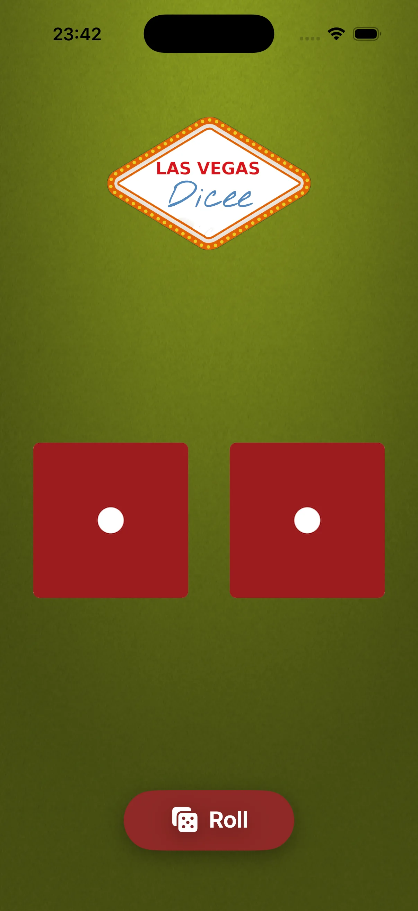

# Dicee 🎲

An iOS dice roller. Tap Roll to reroll two six-sided dice.

<p align="center">
  
</p>

---

## 🧭 Features

* Rolls two dice independently
* Spin animation and haptic feedback on each roll
* Logo spacing adjusts for portrait and landscape

---

## 🛠️ Tech Stack

* **Language:** Swift 6
* **UI:** SwiftUI
* **Platform:** iOS 18.0+

---

## 🚀 Setup

```bash
git config core.hooksPath .githooks   # enable swift-format pre-commit hook
open Dicee.xcodeproj
```

Build and run from Xcode, or use the CLI helper:

```bash
scripts/xc.sh build   # build for the pinned simulator
```

---

## 📦 About

A learning project rebuilding the Dicee roller in SwiftUI. Faces are random, with
a spin animation and haptics on each roll.
